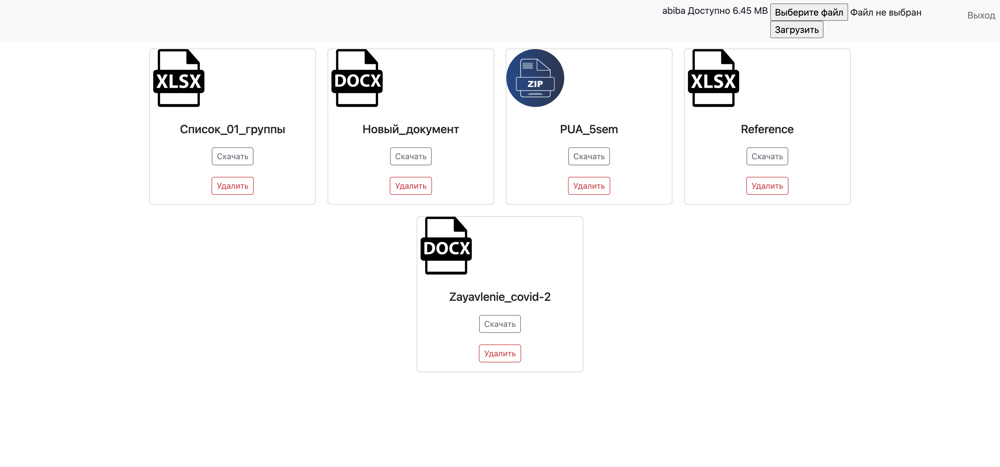
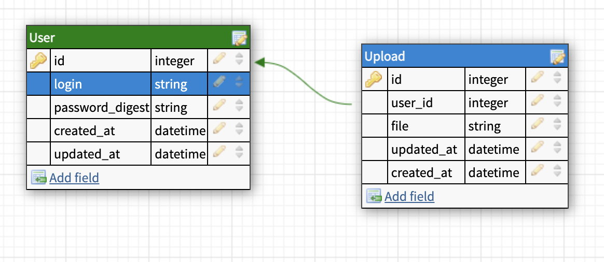

# X-Disk project.

## Overview

Task: As part of the test task, you are invited to implement a Yandex.Disk analog cloud storage service.
The service should consist of an external part, a login form, and a registration page. And an internal part, with the ability to view, upload, download, or delete already uploaded files.
The name of the service is X-Disk.

Technology basis: 
- Backend: Ruby, Ruby on Rails
- Database: PostgreSQL
- Frontend: classic ruby MVC patterns 
## Installing the environment
1. Install important dependencies:
    - Linux (Debian-based distros):
        - `sudo apt install git make`
    - MacOS
        - `brew install git make`
1. Clone this repository.
1. Enter the directory of cloned repository.
1. `make setup`
1. `make preinstall`

## Running the server locally
- Open a console and do `make install`
- Open another console and do `make runserver`

- NOTE #1: `make install` is doing only a migration and then starts the server.
  - If you want to drop DB and rebuild the dependencies, use `make preinstall` again.
- NOTE #2: Use `make install` console to do `rake` \ `rails` - specific stuff.

## Database relations demonstration
